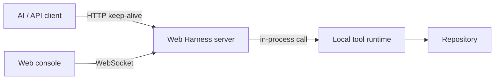
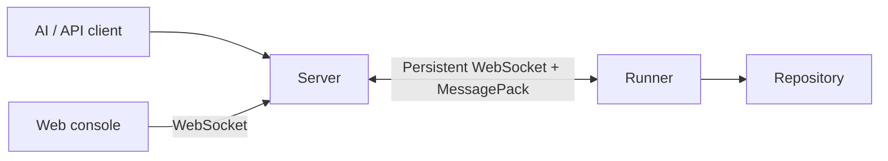

# Architecture

Web Harness borrows the strong trust-boundary idea from WebCodex — the repository runtime owns filesystem and process access — but optimizes the common personal-workstation path.

## Local mode



Local mode removes the server-to-runner network hop. This is the default when the server and repository live on the same machine.

## Remote mode



The remote transport is outbound from the runner, so the repository host does not need to expose a listening port.

## Package map

```text
apps/server       HTTP API, WebSocket gateway, local runtime, remote runner client
apps/web          Preact observability console
packages/protocol Shared typed wire protocol + MessagePack codec
docs              VitePress documentation site
```

## Deliberate scope

The first release keeps the runtime surface intentionally small: project info, bounded file I/O, Git status/diff, and argv-based process execution. MCP/OpenAPI adapters can sit above this kernel without changing the repository trust boundary.
